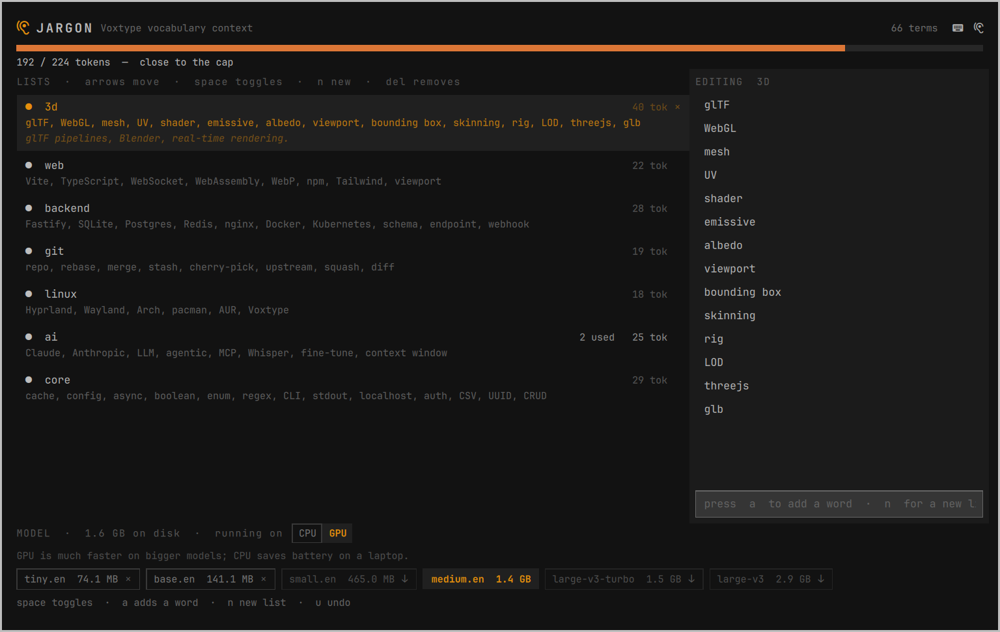

# Jargon



### "I've got all the best words."

If Voxtype keeps mishearing your voice, take control. Give it the vocabulary
you actually use — 3D creation, coding, knitting, whatever your words are.
Change the size of the Whisper model that does the listening. Choose whether it
runs on your CPU or your GPU, depending on what matters more, speed or battery.

An [Omarchy](https://omarchy.org) plugin for [Voxtype](https://voxtype.io),
the push-to-talk dictation built into Omarchy. Click the
ear in your bar (or press **Super+F9**), tick the vocabulary that matches your
work, and your words come out right the first time you say them.

---

## The problem

Voxtype transcribes with Whisper. On a small model it guesses at words it has
barely seen:

| you say | you get |
|---|---|
| GLB | *GOB* |
| caching | *casing* |
| Omarchy | *Amachi* |
| Hyprland | *Hyperland* |

Voxtype can already fix this. It has a setting called `whisper.initial_prompt`
that biases what the model expects to hear — but it ships **empty**, lives in a
TOML file nobody opens, and has a size limit you will cross without being told.

Jargon fills that setting in, and stops you overflowing it.

## What it does

- **A vocabulary, ready to use.** Seven premade lists — 3D, web, backend, git,
  Linux, AI, everyday dev — written and grouped so you enable two or three and
  you are done.
- **Make them yours.** The premade lists are a starting point, not a
  catalogue. Edit them, rename them, or remove them entirely and add lists of
  your own in their place — knitting, your client's product names,
  `char-goatman`, `Mixamo`.
- **Your own words.** Add the names, brands and project words nothing else will
  get right.
- **A budget you can see.** The prompt has a hard limit and Whisper silently
  throws away the overflow. Jargon counts it exactly and refuses to let you go
  over.
- **Tells you what is working.** It reads which of your words actually turn up
  in your dictation, so you know what earns its place and what to cut.
- **Manages your models too.** Download, switch and delete Whisper models from
  the same panel, with progress and a cancel button.
- **CPU or GPU.** See which one Voxtype is running on and switch with one
  click. GPU is much faster on bigger models; CPU saves battery on a laptop.
  Switching restarts Voxtype so it takes effect immediately.

## Requirements

- Omarchy with `omarchy-shell` (the Quickshell-based bar)
- Voxtype installed and running (`voxtype --version`)
- Python 3 (the panel calls a small bundled script, `jargon`)
- Optional, for the CPU/GPU switch: a Voxtype build with GPU support (the
  Vulkan build) and a Vulkan driver

## Install

```bash
omarchy plugin add https://github.com/Rufussed/omarchy-jargon.git --enable
```

Plugins land disabled unless you pass `--enable`, so you can read the code
first. Once enabled, an **ear icon** appears in your bar; click it to open the
panel. It is one plugin: the ear and the panel come and go together.

**Super+F9** is optional. Turn it on from the keyboard icon at the top right
of the panel, or add the line yourself to `~/.config/hypr/bindings.lua`:

```lua
o.bind("SUPER + F9", "Voxtype vocabulary context", "omarchy-shell shell toggle rufussed.jargon")
```

Prefer a script? Clone the repo and run `./install.sh`. It does the same
thing, adds the `jargon` command to your PATH, and binds Super+F9 (backing up
`bindings.lua` first, and saying so instead of clobbering an existing
binding). Pass `--no-bind` to skip the keybinding.

A good mnemonic: **F9 dictates, Super+F9 configures what it hears.**

## Removing it

```bash
omarchy plugin remove rufussed.jargon
```

That removes the plugin and the ear. (To just hide the ear, use the ear toggle
in the panel instead.) If you added the keybinding, delete the
`Jargon` block from `bindings.lua` (or turn the keyboard icon off in the panel
first). Your lists live in `~/.config/jargon/`; delete that folder to remove
them too. Voxtype's own `whisper.initial_prompt` keeps whatever Jargon last
wrote; `jargon reset` clears it.

## What it touches

Jargon runs unsandboxed like every Omarchy plugin, so, plainly:

- Writes Voxtype's `whisper.initial_prompt` (via `voxtype config set`) and
  restarts the `voxtype` user service so it takes effect.
- Downloads and deletes Whisper model files in
  `~/.local/share/voxtype/models` (via `voxtype setup --download`).
- Reads the Voxtype journal to count which of your words get used.
- Stores your lists and settings in `~/.config/jargon/`.
- Optionally edits `~/.config/hypr/bindings.lua` (the Super+F9 binding).
- The **CPU/GPU switch** runs `pkexec voxtype setup gpu --enable|--disable`,
  which asks for your password through the normal polkit prompt and changes
  which Voxtype binary `/usr/bin/voxtype` points at.
- No network access other than the model downloads Voxtype itself performs.

## Using it

Click the ear icon in your bar, or press **Super+F9** if you bound it.

| key | does |
|---|---|
| `↑` `↓` `←` `→` | move around: lists, words, CPU/GPU, models (`tab` also hops) |
| `space` / `enter` | turn a list on or off; remove the highlighted word; switch CPU/GPU; pick a model |
| `a` | add a word to the selected list |
| `n` | make a new list |
| `del` | remove the highlighted word or model |
| `u` / `ctrl+z` | undo the last removed word |
| `×` | delete a list, or click a word to remove it |
| `esc` | close |

Top right of the panel has two small toggles — a keyboard and an ear — for the
Super+F9 keybinding and the bar icon. Turning the icon off hides it without
disabling the plugin (`jargon surface icon off`). One of the two always has to
stay on, since otherwise nothing could open the panel again.

Changes apply when you close the panel, and Voxtype restarts itself. There is
no save button.

**Write words the way you want them typed** — `GLB`, not "gee el bee". You are
showing the model the spelling you want, not how it sounds.

**Add a word when you said it and the wrong thing appeared.** That is the only
signal worth acting on. Words the model already gets right cost budget and buy
nothing.

## From the terminal

Everything the panel does, the CLI does:

```bash
jargon                      # what is on and what it costs
jargon lists                # every list, with its words and cost
jargon enable 3d git        # turn lists on
jargon add "Mixamo" --to 3d # add a word
jargon new wizard-game      # make a list
jargon usage                # which words actually get used
jargon models               # what is installed, what is running
jargon model small.en       # download if needed, then switch
```

## How it works

There is no dictionary and no spell-check. Jargon uses Whisper's **initial
prompt**: a short piece of text the model reads before it transcribes, which
Voxtype exposes as `whisper.initial_prompt`. Jargon builds that prompt from the
lists you have switched on, stays inside its limit, and restarts Voxtype so it
is picked up. The limit is 224 tokens, and it is Whisper's, not Voxtype's.

Whisper writes text one piece at a
time, weighing what it heard against the words already in front of it. Your
vocabulary is placed there as context, so when the audio is ambiguous between
"GOB" and "GLB", the surrounding technical words tip the balance.

Two things follow from that:

- **It biases, it does not guarantee.** If the audio clearly says something
  else, a listed word still loses.
- **It only helps words in the prompt.** The prompt holds **224 tokens** and
  Whisper silently discards anything past that — dropping the *earliest* words
  first. That is why Jargon counts exactly, using the tokenizer read out of your
  own model file, rather than estimating.

If your vocabulary is bigger than the budget, a **bigger model** is the other
lever. A model that has seen more text needs less help from you.

## What this does not do

Jargon only writes `whisper.initial_prompt` — prevention, before the mistake.

It never touches `text.replacements`, which rewrites mistakes after the fact.
Those rules have to match the exact garbled text Whisper produced, so they are
personal to your voice and your microphone; a shipped list of them would be
noise. For the handful of words that resist biasing — usually brand names with
no natural context — use
[teach-voxtype](https://github.com/Enovara/omarchy-teach-voxtype), which records
you saying the word and maps what Whisper actually heard. The two work together:
Jargon for your vocabulary, teach-voxtype for the stubborn few.

## Credits

[teach-voxtype](https://github.com/Enovara/omarchy-teach-voxtype) by Enovara
solved the hard half of this problem first, and is the right tool for words a
prompt cannot fix. Jargon covers the other half — the ordinary technical
vocabulary that only ever needed a word list.

`NOTES.md` has the design reasoning, the prior-art survey and the bugs found
along the way.

## License

MIT
